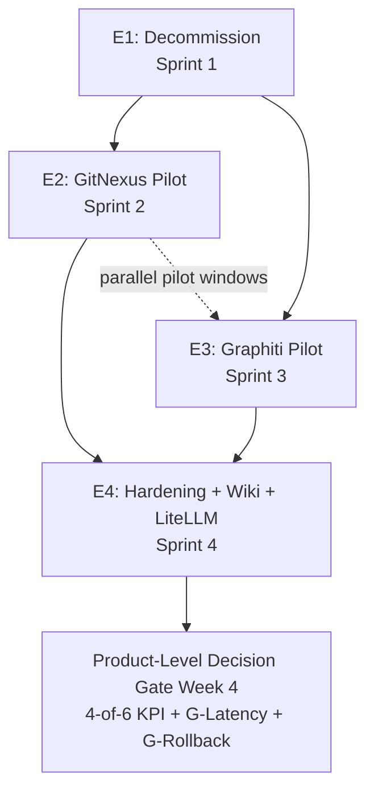

# Context Stack — Epic Plan

This artifact decomposes Context Stack delivery into four epics, one per sprint, aligned to the four phases described in the brief (§4.3) and architecture (§4). Story-level INVEST acceptance criteria are produced separately in Phase 4b — this document carries story titles and one-line purposes only.

The four-epic structure is **not invented here**. It is the structure already locked in by:

- Brief §4.3 (four-phase plan: Decommission → Adopt → Wiki → LiteLLM bridge).
- PRD §11 (acceptance criteria for product release; phase-by-phase exit conditions).
- Architecture §4 (component diagrams per layer) and §9 (ADR index).
- ADR-010 (single-PR-with-8-sequenced-commits decommission strategy → Epic 1).
- ADR-014 (post-recalibration FR distribution → influences epic scope, not structure).

---

## 1. Epic Map (one-page overview)

| Epic ID | Name | Goal (one sentence) | Sprint | Dependencies | Exit Criteria summary | FR coverage (count) |
|---|---|---|---|---|---|---|
| **E1** | Decommission | Remove MemPalace + OMEGA from workstation, repo, dev_hosts container, and Hermes config in a single PR with 8 sequenced commits. | Sprint 1 | None (first epic) | PR merged + tag `phase-1-decommission-complete` set + `grep -r -i 'mempalace\|omega' homelab/` returns 0 + Hermes `verify.yml` exits 0 on `ct-dev-homelab` | 12 (FR-DEC-001..012) + 2 deploy (FR-DEP-001, FR-DEP-009) = **14** |
| **E2** | GitNexus Pilot | Install GitNexus v1.6.3 on workstation as MCP-native code-graph; auto-reindex on commit; smoke-test parent-folder topology; pass week-1 KPI gate. | Sprint 2 | E1 merged (clean baseline) | 4-of-6 KPI scorecard green at week 1; footprint < 500 MB; export wrapper exists; G-Latency clean | 12 (FR-CG-001..012) + 1 deploy (FR-DEP-003) = **13** |
| **E3** | Graphiti Pilot | Stand up Graphiti + FalkorDB on `ct-ai-01`; wire MCP HTTP transport; backup strategy live; smoke-test 5 scenarios; pass week-2 KPI gate. | Sprint 3 | E1 merged; E2 in pilot (KPIs not blocking — runs in parallel review window) | 4-of-6 KPI scorecard green at week 2; FalkorDB < 200 MB; backup + restore drill executed; namespacing on `tom-personal` verified | 15 (FR-MEM-001..015) + 2 deploy (FR-DEP-002, FR-DEP-010) + 2 obs (FR-OBS-003, FR-OBS-005) = **19** |
| **E4** | Production Hardening + LLM-Wiki + LiteLLM Bridge | Author wiki tier; ship `wiki-query` skill; deliver daily $1 cap; build LiteLLM bridge behind validation gate; deploy via Ansible role to `ct-dev-homelab`; run product-level KPI scorecard at week 4. | Sprint 4 | E1, E2, E3 all complete (wiki seeds reference adopted tools; LiteLLM bridge targets Graphiti) | 4-of-6 KPI scorecard green at week 4; G-Rollback validated on `ct-dev-homelab`; wiki seeded with ≥ 3 entries × 3 sessions; LiteLLM gate passed OR Phase 4 deferred per FR-LLM-007 | 10 (FR-WIKI-001..010) + 8 (FR-LLM-001..008) + 4 obs (FR-OBS-001, 002, 004, 006) + 5 deploy (FR-DEP-004, 005, 006, 007, 008) = **27** |

**Total FR coverage:** 14 + 13 + 19 + 27 = **73 / 73** PRD FRs (full coverage; no FR uncovered — see §8 audit).

**Sprint cadence reference (PRD §11 + brief §4.3):** the brief commits each phase to a single sprint. The architecture (§1, §11.AR2) and ADR-010 lock Phase 1 to a single sprint and a single PR. Phase 4 is stretch — if Phase 4 is descoped, E4's LiteLLM stories migrate to a "Phase 4 spike" backlog.

---

## 2. Sprint-to-Epic Mapping

```
Sprint 1 ──► E1 Decommission ──┐
                                │
Sprint 2 ──► E2 GitNexus Pilot ─┼──► Decision Gate W1: 4-of-6 KPI green?
                                │       └─► no  → migrate-or-revert per brief §4.3
                                │       └─► yes → continue
                                │
Sprint 3 ──► E3 Graphiti Pilot ─┼──► Decision Gate W2: 4-of-6 KPI green?
                                │       └─► no  → migrate-or-revert
                                │       └─► yes → continue
                                │
Sprint 4 ──► E4 Hardening + Wiki + LiteLLM ─► Decision Gate W4 (product-level):
                                                  4-of-6 KPI + G-Latency + G-Rollback
                                                  └─► no  → exit ramp (FR-DEP-007)
                                                  └─► yes → product done
```

**Notes on dependencies:**
- E1 must merge before E2 starts (clean baseline; no settings.json conflicts on hooks).
- E2 and E3 can run in *parallel pilot windows* once both are deployed — the week-1 / week-2 KPI gates are time-windows after each respective deploy, not strict serial sprints. But install + smoke-test sequencing is E2-then-E3 because GitNexus is workstation-side (lower-risk install) and Graphiti requires the cloud-LLM signoff + network plumbing.
- E4 cannot start until E2 and E3 are at least *deployed* (wiki references Graphiti facts; LiteLLM bridge wraps Graphiti's LLM call). Story E4-S07/08 (Ansible role + ct-dev-homelab deploy) explicitly depends on completed E2/E3 artifacts.
- The product-level KPI scorecard (E4-S11) measures the whole stack at week 4 — this is the brief §6 / PRD §7 release gate.

**Decision gates within epics:** E2 has a week-1 internal gate (E2-S08); E3 has a week-2 internal gate (E3-S09); E4 has the week-4 product-level gate (E4-S11). The LiteLLM bridge has its own validation gate (E4-S06) per FR-LLM-005.

---

## 3. Epic E1: Decommission

### 3.1 Goal

Cleanly remove MemPalace and OMEGA from the workstation, the homelab repo, the `ct-dev-homelab` container, and the Hermes auto-responder configuration. Single PR, 8 sequenced commits per ADR-010. Tagged release `phase-1-decommission-complete` becomes the rollback target for the rest of the product.

### 3.2 Scope (in / out)

**In scope:**
- Workstation deletions: `~/.mempalace/`, OMEGA Python package, four OMEGA hook entries in `~/.claude/settings.json`, `knowledge-query` orchestrator skill.
- Repo deletions: Ansible roles `ai-dev-mempalace` + `ai-dev-omega-memory`, three Hermes mempalace skills, `wire-mempalace.yml`, dev_hosts container group_vars for OMEGA.
- Hermes Jinja edits (the riskiest commit): conditional removal in `config.yaml.j2`, `defaults/main.yml`, `verify.yml`.
- Decommission doc authored under `homelab-playbook/`.
- End-to-end Hermes verify run on `ct-dev-homelab`.
- Tag the merged commit `phase-1-decommission-complete`.

**Out of scope:**
- Any data migration from MemPalace or OMEGA stores (FR-DEC-012; both stores empty/near-empty).
- Adoption of GitNexus or Graphiti (E2/E3).
- Wiki tier work (E4).
- Hermes adoption of any new memory layer (brief NG3 — Hermes memory layer is permanently out of scope).

### 3.3 Dependencies

None. E1 is the first epic and runs against the pre-Context-Stack baseline. Pre-condition: `ct-dev-homelab` is reachable and the operator's existing Hermes role has its current `verify.yml` working pre-decommission (used to compare against the post-decommission run).

### 3.4 Acceptance Criteria (epic-level)

E1 is "done" when **all** of:

1. The PR is merged to `main` with a merge commit (not squash) per ADR-010 (preserves per-commit revertability on `main`).
2. The merged commit is tagged `phase-1-decommission-complete`.
3. `grep -r -i 'mempalace\|omega' homelab/` excluding the decommission doc, git history, and `_bmad-output/` returns **0** matches (FR-DEC-009).
4. `pgrep -f 'mempalace\|omega'` on the workstation AND on `ct-dev-homelab` returns 0 (FR-DEC-010).
5. Hermes `verify.yml` run on `ct-dev-homelab` exits 0 (FR-DEC-011).
6. `~/.claude/settings.json` has all four OMEGA entries removed; one prior Claude Code session ran clean with hooks disabled before removal (FR-DEC-007 disable-then-remove split).
7. Decommission doc exists at `homelab-playbook/docs/decommission/phase-1-context-stack.md` (or equivalent) and records every action + the FR-DEC-012 no-data-migration record.
8. `MEMORY.md` auto-memory continuity is verified — auto-memory loads end-to-end at next session start.
9. Pre-push hook check for `mempalace|omega` reference creep is added to the repo (forward-protection; downgrades to a CI lint after week 1).

### 3.5 Exit Gate (decision criteria for proceeding to E2)

Proceed to E2 if and only if:
- All nine acceptance criteria above pass.
- No regression in any non-Context-Stack workflow detected during the disable-only Claude Code session (the safety net commit per ADR-010).

If any criterion fails: hold E2 start; `git revert` the offending commit if pre-merge, or exercise FR-DEP-007 rollback (re-install OMEGA + MemPalace from prior commit) if post-merge regression surfaces.

### 3.6 FR Coverage

| FR | Title (abbrev.) | Where covered (story) |
|---|---|---|
| FR-DEC-001 | Delete `~/.mempalace/` | E1-S04 |
| FR-DEC-002 | Delete `ai-dev-mempalace` role | E1-S04 |
| FR-DEC-003 | Delete three Hermes mempalace skills | E1-S04 |
| FR-DEC-004 | Delete `wire-mempalace.yml` | E1-S05 |
| FR-DEC-005 | Edit Hermes Jinja conditionals | E1-S06 |
| FR-DEC-006 | Delete `knowledge-query` orchestrator | E1-S05 |
| FR-DEC-007 | Disable then remove OMEGA hooks | E1-S01 + E1-S02 |
| FR-DEC-008 | Remove OMEGA role + group_vars + uninstall package | E1-S03 |
| FR-DEC-009 | Zero-grep gate | E1-S08 |
| FR-DEC-010 | Zero-process gate | E1-S08 |
| FR-DEC-011 | Hermes verify run | E1-S08 |
| FR-DEC-012 | No-data-migration record | E1-S07 |
| FR-DEP-001 | Decommission via Ansible playbook (idempotent) | E1-S03 + E1-S05 |
| FR-DEP-009 | dev_hosts container playbook updated | E1-S03 |

### 3.7 Risks for this epic + mitigations

| ID | Risk | Source | Mitigation |
|---|---|---|---|
| AR7 | Single-PR wide surface — missed reference ships dead code. | Architecture §11 | FR-DEC-009 grep gate (E1-S08); FR-DEC-011 Hermes verify run; per-commit revertability per ADR-010. |
| R7 | Hermes Jinja edits break unrelated paths. | PRD §10 / Brief §10.1 | Isolate Hermes-Jinja edits in commit 6 (E1-S06); run Hermes verify before tagging (E1-S08); rollback via `git revert` on the specific commit. |
| Operator-irreversibility risk | Squash-merging would collapse the per-commit revertability. | ADR-010 §Consequences | Use **merge commit, NOT squash** (codified in PR description; reviewer-of-one acknowledges in PR body). |

### 3.8 Story Decomposition Outline

Stories map 1:1 to the 8 commits in ADR-010, with one validation/forward-protection story added at the end. Sized for ≤1 day each (decommission is mostly deletions with verifications).

- **E1-S01**: Disable OMEGA hooks in `~/.claude/settings.json` (~0.5d) — Disable the four omega entries; run one full Claude Code session to verify silence (FR-DEC-007 first half). Commit 1 of ADR-010.
- **E1-S02**: Remove OMEGA hook entries from settings.json (~0.5d) — Full removal after the disable-only session passes silent (FR-DEC-007 second half). Commit 2.
- **E1-S03**: Uninstall omega-memory package + remove role + group_vars (~1d) — `pip uninstall`, delete `ai-dev-omega-memory` Ansible role, drop OMEGA group_vars from dev_hosts container playbook (FR-DEC-008, FR-DEP-009). Commit 3.
- **E1-S04**: Remove MemPalace store + role + skills (~1d) — Delete `~/.mempalace/`, `ai-dev-mempalace` role, three Hermes skills `mempalace-kg-query` / `mempalace-diary` / `mempalace-search` (FR-DEC-001..003). Commit 4.
- **E1-S05**: Remove MemPalace wiring + knowledge-query orchestrator (~0.5d) — Delete `wire-mempalace.yml` and the degenerated `knowledge-query` skill (FR-DEC-004, FR-DEC-006). Commit 5.
- **E1-S06**: Remove mempalace conditionals from Hermes Jinja (~1.5d) — Edit `config.yaml.j2`, `defaults/main.yml`, `verify.yml` to strip every `mempalace` conditional (FR-DEC-005). Riskiest commit; isolated for review. Commit 6.
- **E1-S07**: Author Phase-1 decommission doc (~0.5d) — Capture every action + FR-DEC-012 no-data-migration record under `homelab-playbook/docs/decommission/`. Commit 7.
- **E1-S08**: Hermes verify run on ct-dev-homelab + grep/process gates (~1d) — Execute `verify.yml` on `ct-dev-homelab`; commit verify-output as evidence; run `grep -r -i 'mempalace\|omega'` and `pgrep` gates (FR-DEC-009, 010, 011, FR-DEP-006 first half). Commit 8.
- **E1-S09**: Forward-protection pre-push hook + tag release (~0.5d) — Install repo-local pre-push hook that fails on new `mempalace|omega` references; tag merged commit `phase-1-decommission-complete`.

**Story count: 9.** Total estimated effort: ~7 days, fits Sprint 1.

---

## 4. Epic E2: GitNexus Pilot

### 4.1 Goal

Install GitNexus v1.6.3 on the workstation as the MCP-native code-graph layer; wire PreToolUse + PostToolUse-on-commit hooks for auto-reindex; verify parent-folder topology over `~/workspace/homelab/`; run five smoke-test scenarios; deliver export wrapper to close the exit-ramp obligation; reach the week-1 decision gate.

### 4.2 Scope (in / out)

**In scope:**
- `npm install -g gitnexus@1.6.3` on workstation; `npx gitnexus setup` for MCP registration.
- Hook entries in `~/.claude/settings.json` (PreToolUse + PostToolUse-on-Bash-commit).
- Parent-folder topology configuration over `~/workspace/homelab/` (covers all three sibling repos).
- Footprint verification (close AR1 — RSS < 500 MB).
- Five smoke-test scenarios (cross-repo question, impact analysis, context retrieval, reindex timing on incremental + full).
- Export wrapper script at `scripts/gitnexus-export.sh` (NDJSON per ADR-012, closes Q8 / FR-CG-010).
- Week-1 decision-gate scorecard (K1 token-reduction sample, K2 reindex timing, K3 spend, K4 non-blank artifact, K6 subjective "did it save me a re-read").
- Workstation Ansible role or shell installer (FR-DEP-003).

**Out of scope:**
- Graphiti adoption (E3).
- Wiki authorship (E4).
- Any LLM call for code-parsing — GitNexus is local-AST only (FR-CG-012, ADR-004).
- Phone-facing surfaces.
- Path/branch reindex filtering — ADR-014 downgraded FR-CG-005 to COULD; if reindex is too chatty, filtering is a Sprint 2 follow-up not a launch story.

### 4.3 Dependencies

- **Hard:** E1 merged (settings.json must not contain OMEGA hook entries before GitNexus hooks are appended).
- **Soft:** Operator's Anthropic API + Claude Code CLI working baseline (existing).

### 4.4 Acceptance Criteria (epic-level)

E2 is "done" when all of:

1. `gitnexus@1.6.3` installed; `npx gitnexus setup` registered MCP for Claude Code; `claude mcp list` shows `gitnexus` as healthy.
2. PreToolUse + PostToolUse hooks present in `~/.claude/settings.json` and fire on `git commit` Bash invocations.
3. Parent-folder topology over `~/workspace/homelab/` indexes all three sibling repos; `cypher` tool query returns nodes from all three.
4. Daemon RSS < 500 MB measured over 24 h (NFR-FOOTPRINT-002 / closes AR1).
5. Incremental reindex < 30 s on a typical commit (NFR-PERF-004); full reindex < 60 s on cold start (NFR-PERF-005).
6. Five smoke-test scenarios pass (E2-S06).
7. `scripts/gitnexus-export.sh` produces NDJSON output matching ADR-012 schema; exit-ramp doc references the wrapper.
8. Week-1 decision gate: ≥ 4-of-6 KPIs green (K1, K2, K3, K4, K6 in scope at this stage; K5 needs Graphiti so excluded from E2 gate). PRD §7 / Brief §6.

### 4.5 Exit Gate (decision criteria for proceeding to E3)

Proceed to E3 (Graphiti) regardless of E2 KPI outcome — the two pilots are independent. **However**, if E2 fails the week-1 gate or AR1 (footprint) fires, log the regression and either (a) exercise the GitNexus-only rollback (FR-DEP-007 Phase-2 portion: `npm uninstall -g gitnexus` + `claude mcp remove`), or (b) accept the regression with a documented gap and continue to E3. The product-level decision gate at week 4 (E4) is the binding one.

### 4.6 FR Coverage

| FR | Title (abbrev.) | Where covered (story) |
|---|---|---|
| FR-CG-001 | Install on workstation as MCP-native | E2-S01 |
| FR-CG-002 | Local-only; no source code leaves machine | E2-S02 (verified) + E2-S05 |
| FR-CG-003 | Parent-folder topology over `~/workspace/homelab/` | E2-S05 |
| FR-CG-004 | PreToolUse + PostToolUse hooks | E2-S04 |
| FR-CG-005 | Auto-reindex on every commit (now COULD per ADR-014) | E2-S04 |
| FR-CG-006 | Incremental reindex ≤ 30 s | E2-S06 (smoke-test) |
| FR-CG-007 | Full reindex ≤ 60 s | E2-S06 (SHOULD per ADR-014) |
| FR-CG-008 | K1 ≥ 5× token reduction | E2-S08 (week-1 gate) |
| FR-CG-009 | Non-blank GRAPH_REPORT-style artifact | E2-S06 |
| FR-CG-010 | JSON-exportable graph | E2-S07 (export wrapper) |
| FR-CG-011 | Graceful degradation if unavailable (SHOULD per ADR-014) | E2-S06 (one scenario stops daemon) |
| FR-CG-012 | No LLM API call for parsing | E2-S02 + E2-S05 (network audit) |
| FR-DEP-003 | Workstation install captured in script/role | E2-S01 |

### 4.7 Risks for this epic + mitigations

| ID | Risk | Source | Mitigation |
|---|---|---|---|
| AR1 | npm + Node.js footprint may exceed 500 MB. | Architecture §11 | E2-S02 measures RSS at week 0 and 24h; if > 500 MB, file follow-up story for browser-side mode or revisit ADR-004 (exit ramp to CodeGraphContext). |
| R1 / AR4 | GitNexus is single-maintainer (abandonment risk). | Brief §10.1, Arch §11 | NFR-SUPP-001 inspection at adoption (E2-S01 includes "verify ≥ 3 mo upstream activity" check); export wrapper (E2-S07) exists from day 1. |
| Supply-chain risk | npm typosquat lesson (graphify vs graphifyy). | Architecture §5.3 | Pin `gitnexus@1.6.3` exactly; verify package name + maintainer + checksum on first install (E2-S01 includes the check). |
| G-Latency | New hooks may regress session-start latency. | PRD §7 / Brief §6 | E2-S08 gate measures NFR-PERF-001; if > 1 s overhead added, hooks are flagged as the cause and tuned. |

### 4.8 Story Decomposition Outline

- **E2-S01**: Install GitNexus v1.6.3 + supply-chain verification (~1d) — `npm install -g gitnexus@1.6.3`; verify maintainer, checksum, ≥ 3 mo upstream activity (NFR-SUPP-001); capture install in workstation Ansible role / shell installer. (FR-CG-001, FR-DEP-003.)
- **E2-S02**: Verify footprint < 500 MB (~0.5d) — Sample daemon RSS over 24 h; close AR1; document in week-0 baseline note. (NFR-FOOTPRINT-002.)
- **E2-S03**: Wire MCP registration to Claude Code (~0.5d) — Run `npx gitnexus setup`; verify `claude mcp list` shows `gitnexus` healthy; tool surface (`cypher`, `impact`, `context`, `reindex`) advertised. (FR-CG-001.)
- **E2-S04**: Configure PreToolUse + PostToolUse-on-commit hooks (~1d) — Edit `~/.claude/settings.json`; PostToolUse fires on Bash containing `git commit`; no path/branch filter (FR-CG-005 default). (FR-CG-004, FR-CG-005.)
- **E2-S05**: Configure parent-folder topology + privacy audit (~1d) — Configure GitNexus to index `~/workspace/homelab/` covering all three sibling repos; run `tcpdump`-style network audit during a full reindex to confirm no outbound LLM-API calls. (FR-CG-003, FR-CG-002, FR-CG-012, NFR-PRIV-001.)
- **E2-S06**: Implement 5 smoke-test scenarios (~1.5d) — (1) cross-repo "which roles reference X" query; (2) impact analysis on a symbol; (3) context retrieval for a file; (4) incremental reindex timing on a typical commit; (5) full reindex timing on cold start; (6) graceful-degradation drill (stop daemon, verify session continues). (FR-CG-006, FR-CG-007, FR-CG-009, FR-CG-011.)
- **E2-S07**: Implement export wrapper `scripts/gitnexus-export.sh` (~1d) — Per ADR-012 NDJSON schema; closes Q8 and FR-CG-010; documents exit ramp to CodeGraphContext. (FR-CG-010, NFR-PORT-001, NFR-SUPP-002.)
- **E2-S08**: Week-1 decision-gate scorecard (~0.5d) — K1 token-reduction sample on 3 representative cross-repo questions; K2 reindex timings from hook logs; K3 spend (should be 0 — local-only); K4 non-blank artifact check; K6 subjective uplift note. Gate decision recorded in retro. (FR-CG-008, brief §6.)

**Story count: 8.** Total estimated effort: ~7 days, fits Sprint 2.

---

## 5. Epic E3: Graphiti Pilot

### 5.1 Goal

Deploy Graphiti + FalkorDB as Docker Compose stack on `ct-ai-01`, bound to `127.0.0.1` and reached via Tailscale; configure `gpt-4o-mini` extraction LLM + `text-embedding-3-small` embeddings; namespace all writes on `tom-personal`; deliver three-layer backup (AOF + RDB + monthly Cypher export) per ADR-007; smoke-test five functional scenarios; reach the week-2 decision gate.

### 5.2 Scope (in / out)

**In scope:**
- Docker Compose stack at `/srv/graphiti/docker-compose.yml` on `ct-ai-01`; `.env` mode 600.
- Pinned image tags: `zepai/graphiti-mcp:v1.0.2` + `falkordb/falkordb:<pinned>` (FR-DEP-010).
- MCP HTTP transport on `127.0.0.1:8000`; Tailscale-reach pattern (matches phone-notifications-tailscale).
- `gpt-4o-mini` LLM (ADR-002), `text-embedding-3-small` embeddings (ADR-003), `SEMAPHORE_LIMIT=5` (FR-MEM-006).
- All writes on `group_id="tom-personal"` (FR-MEM-005); verify-default-group story (closes AR8).
- Backup cadence per ADR-007: AOF (in-process), daily AOF rewrite cron, weekly RDB cron, monthly Cypher JSON export. Restore drill once.
- Five functional scenarios from `graphiti-claude-code-install-plan-2026-04-25.md` §7.
- Telemetry disabled (FR-MEM-011, SHOULD per ADR-014).
- `CLAUDE.md` Memory section (FR-MEM-010, SHOULD per ADR-014).
- Week-2 decision-gate scorecard (full 6-of-6 KPIs in scope including K5 first-shot recall).

**Out of scope:**
- Wiki authorship (E4).
- LiteLLM bridge (E4 / Phase 4 stretch).
- `ct-dev-homelab` end-to-end deploy via Ansible role — that's E4 (wraps both pilots into a single deployable role).
- Production-class promotion off `ct-ai-01` (single-operator, no production tier).

### 5.3 Dependencies

- **Hard:** E1 merged (no OMEGA hook entries colliding with new MCP entries).
- **Soft:** E2 deployed (parallel pilot windows; not blocking).
- **External:** OpenAI API key provisioned and mode-600 in `/srv/graphiti/.env`; `ct-ai-01` reachable over Tailscale; Docker + docker-compose installed on `ct-ai-01`.
- **Reference:** Operative install procedure is the existing 488-line runbook `graphiti-claude-code-install-plan-2026-04-25.md` §6 (steps 1-15); architecture §8.4 explicitly does NOT duplicate it.

### 5.4 Acceptance Criteria (epic-level)

E3 is "done" when all of:

1. `docker compose ps` on `ct-ai-01` shows `graphiti-mcp` + `graphiti-falkordb` Up.
2. `claude mcp list` on workstation shows `graphiti` over HTTP transport, healthy.
3. `add_episode` returns a UUID for a probe write; subsequent `search_facts` returns the fact (smoke test 1+2 from runbook §7).
4. Bi-temporal query returns expected `valid_at` for an explicitly-dated episode (smoke test 3 from runbook §7).
5. Default group_id behaviour verified — all writes land in `tom-personal`, not `main` (closes AR8).
6. FalkorDB resident memory < 200 MB at end of week 2 (FR-MEM-015 / NFR-FOOTPRINT-001).
7. Backup files exist: AOF rewriting daily, RDB weekly, Cypher JSON monthly (first one within Sprint 3); restore drill once-executed and documented.
8. `SEMAPHORE_LIMIT=5` set; telemetry off; pinned image tags in compose file.
9. Week-2 decision gate: ≥ 4-of-6 KPIs green (K1-K6 all in scope; K5 first-shot recall measured on operator-tagged retro entries from one full week).

### 5.5 Exit Gate (decision criteria for proceeding to E4)

Proceed to E4 if:
- All nine acceptance criteria above pass.
- Combined daily spend across E2 + E3 stays under the $1/day informal cap (formal auto-throttle is E4).
- No blocking-tool-call hangs > 3 s observed (NFR-AVAIL-002).

If E3 KPI gate fails: decision per brief §4.3 Phase 2 gate — migrate-or-revert. Exit ramp: `docker compose down` + `claude mcp remove graphiti` + monthly Cypher export retained for replay.

### 5.6 FR Coverage

| FR | Title (abbrev.) | Where covered (story) |
|---|---|---|
| FR-MEM-001 | FalkorDB backend, Docker Compose | E3-S01 |
| FR-MEM-002 | MCP HTTP transport | E3-S02 |
| FR-MEM-003 | 127.0.0.1 + Tailscale reach | E3-S02 |
| FR-MEM-004 | gpt-4o-mini + text-embedding-3-small | E3-S04 |
| FR-MEM-005 | group_id="tom-personal" | E3-S05 |
| FR-MEM-006 | SEMAPHORE_LIMIT=5 | E3-S04 |
| FR-MEM-007 | K5 first-shot recall ≥ 50% | E3-S09 (week-2 gate, SHOULD per ADR-014) |
| FR-MEM-008 | K4 ≥ 25 facts/week | E3-S09 (SHOULD per ADR-014) |
| FR-MEM-009 | Standard MCP tool surface | E3-S05 |
| FR-MEM-010 | CLAUDE.md Memory section | E3-S03 (SHOULD per ADR-014) |
| FR-MEM-011 | Telemetry disabled | E3-S04 (SHOULD per ADR-014) |
| FR-MEM-012 | Cypher export available | E3-S07 |
| FR-MEM-013 | Graceful degradation | E3-S06 (drill) — SHOULD per ADR-014 |
| FR-MEM-014 | Backup mechanism documented + exercised | E3-S07 + E3-S08 |
| FR-MEM-015 | FalkorDB RAM < 200 MB | E3-S09 |
| FR-DEP-002 | Compose + .env mode 600 | E3-S01 |
| FR-DEP-010 | Pinned image tags | E3-S01 |
| FR-OBS-003 | INFO-level log capture + monthly rotation | E3-S04 (SHOULD) |
| FR-OBS-005 | Good-catch tally | E3-S09 (SHOULD) |

### 5.7 Risks for this epic + mitigations

| ID | Risk | Source | Mitigation |
|---|---|---|---|
| AR8 | Default group_id discipline — writes may land in `main` instead of `tom-personal`. | Architecture §11 | E3-S05 explicit verification story; codified in `CLAUDE.md` Memory section (E3-S03). |
| AR3 | OpenAI Usage API eventual consistency — daily cap can overshoot. | Architecture §11 | Cap implementation is in E4 (FR-OBS-002 is COULD per ADR-014); manual billing watch in Sprint 3 + 30-min cron cadence in Sprint 4. |
| R6 | Spend creep if Graphiti ingestion becomes chatty. | Brief §10.1 | `SEMAPHORE_LIMIT=5` baseline (E3-S04); manual daily billing check during Sprint 3; auto-throttle in E4. |
| R2 | Bi-temporal value depends on ≥ 1 month sustained use; operator may judge prematurely. | Brief §10.1 | Week-2 gate is intermediate; product-level gate at week 4 in E4; brief §6 prohibits promote/demote before week 4. |
| Supply-chain | Pinning `latest` would risk silent upstream regressions. | Architecture §5.3 | E3-S01 pins both image tags (FR-DEP-010). |

### 5.8 Story Decomposition Outline

- **E3-S01**: Stand up Docker Compose stack on ct-ai-01 (~1.5d) — Compose file at `/srv/graphiti/docker-compose.yml`; `.env` mode 600 (NOT in git); pinned tags `zepai/graphiti-mcp:v1.0.2` + falkordb pinned; create `/srv/graphiti/data` volume mount. Follows runbook §6 steps 1-7. (FR-MEM-001, FR-DEP-002, FR-DEP-010.)
- **E3-S02**: Configure MCP HTTP transport + Tailscale reach (~1d) — Bind `127.0.0.1:8000`; verify reachability from workstation over tailnet; register with Claude Code via `claude mcp add --transport http graphiti http://...:8000/mcp/`. Runbook §6 steps 8-10. (FR-MEM-002, FR-MEM-003.)
- **E3-S03**: Update CLAUDE.md Memory (Graphiti) section (~0.5d) — Document when to read (`search_facts`, `search_nodes`) vs write (`add_episode`); replaces the deleted OMEGA Memory section. (FR-MEM-010 — SHOULD.)
- **E3-S04**: Configure gpt-4o-mini + embeddings + SEMAPHORE + telemetry-off (~1d) — Set `MODEL_NAME=gpt-4o-mini`, `EMBEDDER_MODEL_NAME=text-embedding-3-small`, `SEMAPHORE_LIMIT=5`, `GRAPHITI_TELEMETRY_ENABLED=false` in `.env`. Configure INFO-level logging + monthly rotation. (FR-MEM-004, FR-MEM-006, FR-MEM-011, FR-OBS-003.)
- **E3-S05**: Smoke-test add_episode + search_facts + verify tom-personal namespacing (~1d) — Probe write returns UUID; search returns the fact; verify default group_id behaviour with an explicit-group write vs default-group write (closes AR8). Runbook §7 tests 1-2. (FR-MEM-005, FR-MEM-009.)
- **E3-S06**: Implement 5 functional scenarios from runbook §7 (~1.5d) — Test 1 write episode; test 2 read it back; test 3 bi-temporal `valid_at` query; test 4 graceful-degradation drill (stop FalkorDB, verify session continues, no > 3 s hang); test 5 multi-episode supersession check. (FR-MEM-009, FR-MEM-013, NFR-AVAIL-002.)
- **E3-S07**: Implement Graphiti backup (cron + AOF + RDB + monthly Cypher export) (~1.5d) — Per ADR-007: in-process AOF (default-on), daily `BGREWRITEAOF` cron, weekly `BGSAVE` cron, monthly `scripts/cypher-export.sh` (closes Q5, FR-MEM-012, FR-MEM-014, NFR-PORT-002).
- **E3-S08**: Restore drill (~1d) — Stop containers; restore from latest AOF + RDB + Cypher export; verify all probe data returns; document in runbook. (FR-MEM-014 exercise; G-Rollback partial validation.)
- **E3-S09**: Week-2 decision-gate scorecard (~0.5d) — K1 token-reduction sample (full 6-KPI scorecard now); K4 facts-per-week count from `get_episodes`; K5 first-shot recall on 8 operator-tagged retro queries; K3 spend; K6 subjective uplift; FalkorDB RAM check via `docker stats`. (FR-MEM-007, FR-MEM-008, FR-MEM-015, FR-OBS-005, brief §6.)

**Story count: 9.** Total estimated effort: ~9.5 days; comfortably fits Sprint 3.

---

## 6. Epic E4: Production Hardening + LLM-Wiki + LiteLLM Bridge

### 6.1 Goal

Deliver the Tier-1 LLM Wiki (file-based markdown under `homelab-playbook/wiki/`) with a thin `wiki-query` skill (read-on-demand, ADR-009); enforce the daily $1 hard-cap auto-throttle (ADR-008); bridge Graphiti's LLM call through LiteLLM to `hybrid_gemma_serving` behind a 95%-well-formed-JSON validation gate (ADR-011); wrap the entire stack in an Ansible role and deploy to `ct-dev-homelab` for the G-Rollback gate; run the product-level KPI scorecard at week 4.

### 6.2 Scope (in / out)

**In scope:**
- Wiki page schema definition (frontmatter + body sections per ADR-006); `_schema.md` and `index.md` bootstrap.
- Three to five seed wiki entries authored from existing memory notes (Tailscale policy, PVE cluster, decommission runbook are obvious candidates).
- `wiki-query` skill at `~/.claude/skills/wiki-query/SKILL.md` (read-on-demand, allowed-tools=Read, ADR-009).
- `scripts/wiki-lint.sh` (link checker, last_reviewed warn, index regen).
- Daily $1 hard-cap auto-throttle: `scripts/cost-cap.sh` + `*/30 * * * *` cron on `ct-ai-01`; ntfy alert via CT101 over Tailscale (closes Q6, FR-OBS-002 — COULD per ADR-014 but architecturally specified in ADR-008).
- LiteLLM bridge config: `OPENAI_BASE_URL` + `MODEL_NAME` env override on graphiti-mcp container (ADR-011); `OPENAI_GENERIC_CLIENT` selection.
- 50-fact validation set + harness; ≥ 95% well-formed-JSON gate; auto-fallback on failure (FR-LLM-005, 006).
- Ansible role `ai-dev-context-stack` (or `ai-dev-graphiti` + workstation-side companion) to deploy the full stack to `ct-dev-homelab`.
- E2E acceptance suite run on `ct-dev-homelab` per FR-DEP-006.
- Weekly observability digest (cost / hit-rate / footprint).
- Documented exit ramps for GitNexus AND Graphiti (NFR-SUPP-002).
- Product-level 4-of-6 KPI scorecard at week 4; G-Latency + G-Rollback gates.
- Phase-4 retro + epic close.

**Out of scope:**
- Wiki content authorship at scale — operator curates over time (FR-WIKI-010, brief NG4). Three seeds is the deliverable.
- GitNexus LLM bridge — per FR-LLM-001, GitNexus is excluded (it has no LLM extraction).
- Embedding routing through LiteLLM — embeddings stay on OpenAI in all phases (FR-LLM-004, ADR-003).
- New graph database deployment beyond FalkorDB (brief NG8).
- Phone-facing surfaces.

### 6.3 Dependencies

- **Hard:** E1, E2, E3 all complete to acceptance.
- **Soft:** `hybrid_gemma_serving` gateway available at LiteLLM endpoint by Sprint 4 mid-week. If not available, Phase 4 (LiteLLM bridge) is deferred per FR-LLM-007 and E4-S05 + S06 become a backlog item; the rest of E4 ships.

### 6.4 Acceptance Criteria (epic-level)

E4 is "done" when **all** of:

1. Wiki tree exists at `homelab-playbook/wiki/` with `index.md`, `_schema.md`, and ≥ 3 seed entries authored.
2. Each seed entry has been consumed by ≥ 3 distinct Claude Code sessions per FR-WIKI-006 (SHOULD post-ADR-014; aim for 3×3, accept 2×2 as ship-able with documented gap).
3. `wiki-query` skill installed at `~/.claude/skills/wiki-query/`; triggers on documented prompts; reads files in ≤ 200 ms (NFR-PERF-003).
4. `scripts/wiki-lint.sh` runs in pre-commit and exits 0 on the seeded tree.
5. Unified query hierarchy doc published (FR-WIKI-007).
6. Daily $1 hard-cap auto-throttle: `cost-cap.sh` cron firing every 30 min on `ct-ai-01`; manual breach test confirms `SEMAPHORE_LIMIT` drops to 1 + ntfy alert fires; auto-restore at UTC day rollover.
7. LiteLLM bridge: 50-fact validation set passes ≥ 95% well-formed JSON gate (FR-LLM-005). If gate fails OR `hybrid_gemma_serving` unavailable, FR-LLM-007 exit invoked — Phase 4 deferred and E4-S05 + S06 stories closed as "deferred" with backlog ticket.
8. Ansible role `ai-dev-context-stack` deploys end-to-end on `ct-dev-homelab`; `verify.yml` exits 0; all five smoke tests pass (FR-DEP-006, SHOULD per ADR-014 — accept 3-of-5 hard-pass + 2-of-5 quality).
9. Rollback exercised once on `ct-dev-homelab`: `docker compose down` + `claude mcp remove` + GitNexus uninstall + skill removal returns the container to pre-deploy state in ≤ 1 day operator-wall-time (FR-DEP-007 / G-Rollback gate).
10. Weekly observability digest template exists and one digest is written.
11. Exit-ramp docs exist for both GitNexus (CodeGraphContext alternative + export wrapper) and Graphiti (Cypher dump + episode replay log) per NFR-SUPP-002.
12. Product-level KPI scorecard at week 4: ≥ 4-of-6 KPIs green AND G-Latency clean (NFR-PERF-001) AND G-Rollback validated.
13. Phase-4 retro authored; epic closed.

### 6.5 Exit Gate (final product release)

Per PRD §11, the product is "done" when E4's acceptance criteria 1-13 hold AND the brief §6 hard gates hold. If criterion 12 fails:
- 4-of-6 KPI scorecard not green → enter migrate-or-revert decision path; FR-DEP-007 rollback exercised on the failing tier.
- G-Latency regressed → investigate per AR2-style drill; if irreducible, stack does not promote off `ct-dev-homelab`.
- G-Rollback not validated → stack does not promote off `ct-dev-homelab` (this is the brief §6 hard gate).

### 6.6 FR Coverage

| FR | Title (abbrev.) | Where covered (story) |
|---|---|---|
| FR-WIKI-001 | wiki-query skill | E4-S03 |
| FR-WIKI-002 | wiki at homelab-playbook/wiki/ | E4-S01 |
| FR-WIKI-003 | file-based markdown, zero-MCP | E4-S01 + E4-S03 |
| FR-WIKI-004 | index.md entry point | E4-S01 |
| FR-WIKI-005 | < 200 ms wiki query | E4-S03 (SHOULD) |
| FR-WIKI-006 | 3 seeds × 3 sessions | E4-S02 (SHOULD) |
| FR-WIKI-007 | Unified query-hierarchy doc | E4-S10 |
| FR-WIKI-008 | Wiki in homelab-playbook git | E4-S01 (SHOULD per ADR-014) |
| FR-WIKI-009 | No LLM dependency in skill | E4-S03 |
| FR-WIKI-010 | Bulk content out of scope | E4-S02 (scope guard) |
| FR-LLM-001 | Bridge Graphiti only | E4-S05 |
| FR-LLM-002 | OpenAIGenericClient path | E4-S05 |
| FR-LLM-003 | OPENAI_BASE_URL + MODEL_NAME override | E4-S05 |
| FR-LLM-004 | Embeddings stay on OpenAI | E4-S05 (env config) |
| FR-LLM-005 | 95% well-formed-JSON gate | E4-S06 |
| FR-LLM-006 | Auto-fallback on failure | E4-S06 |
| FR-LLM-007 | Phase 4 stretch / non-blocking | E4-S05 (deferral path) |
| FR-LLM-008 | Reversible in ≤ 1 day | E4-S06 (revert drill) |
| FR-OBS-001 | Weekly cost-check (SHOULD) | E4-S09 |
| FR-OBS-002 | Daily $1 cap auto-throttle (COULD per ADR-014) | E4-S04 |
| FR-OBS-004 | Weekly retro note | E4-S09 (SHOULD) |
| FR-OBS-006 | GitNexus tool-hit-rate (SHOULD) | E4-S09 |
| FR-DEP-004 | Validation on ct-dev-homelab first | E4-S08 |
| FR-DEP-005 | Phase-3 wiki rollout | E4-S01 + E4-S02 + E4-S03 |
| FR-DEP-006 | E2E + 5 smoke tests | E4-S08 (SHOULD per ADR-014) |
| FR-DEP-007 | Rollback exercised | E4-S08 |
| FR-DEP-008 | No secrets in repo | E4-S07 (Ansible role wraps existing pattern) |

### 6.7 Risks for this epic + mitigations

| ID | Risk | Source | Mitigation |
|---|---|---|---|
| AR2 | LiteLLM Responses API may not work cleanly with all upstream models. | Architecture §11 | E4-S06 validation gate is the trigger for fallback; ADR-011 fallback path = side-by-side LiteLLM proxy or revert env vars (FR-LLM-008). |
| AR5 | Graphiti `OpenAIGenericClient` selection may have undocumented bugs that defeat the no-fork path. | Architecture §11 | E4-S05 spike runs first; if no-fork path doesn't work, E4-S06 falls back to side-by-side proxy per ADR-011 alt; worst case Phase 4 deferred (FR-LLM-007). |
| AR3 | OpenAI Usage API eventual consistency causes daily cap to overshoot by cents. | Architecture §11 | E4-S04 cron cadence is 30 min; documented overshoot risk is acceptable given $20/month total budget. |
| AR6 | Wiki content drift (last_reviewed > 6 months across pages). | Architecture §11 | E4-S01 includes `last_reviewed` field in schema; `wiki-lint.sh` warns; quarterly wiki-review backlog ticket created at retro. |
| R3 | LiteLLM bridge unproven for Graphiti's extraction-JSON quality. | Brief §10.1 | FR-LLM-005 gate is the hard requirement; FR-LLM-007 makes Phase 4 stretch — Phase 1-3 ship without it. |
| R8 | Operator may treat SHOULDs as optional and ship with gaps. | PRD §10 | Weekly retro tracks SHOULD coverage; Sprint 4 retro confirms split worked (per ADR-014 validation criterion). |
| G-Rollback failure | If rollback drill fails, the stack does not promote off ct-dev-homelab. | Brief §6 hard gate | E4-S08 exercises rollback as a hard story; failure here is product-blocking by design. |

### 6.8 Story Decomposition Outline

- **E4-S01**: Define wiki page schema + bootstrap index.md + _schema.md (~1d) — Frontmatter spec per ADR-006 (title, slug, category, last_reviewed, owner, related_pages, related_frs, related_adrs, status, supersedes, superseded_by); body sections (Summary / Context / Procedure-or-Decision-or-Definition / Cross-references); directory layout (architecture / runbooks / decisions / glossary / projects); `index.md` template; commit `_schema.md`. (FR-WIKI-002, 003, 004, 008, ADR-006.)
- **E4-S02**: Bootstrap initial 3-5 wiki seed entries (~1.5d) — Author from highest-leverage existing memory notes: Tailscale-only network policy, PVE 9.x cluster topology, decommission runbook, Graphiti install runbook reference, GitNexus topology decision. Each entry tracked by ≥ 3 Claude Code sessions during the same week. (FR-WIKI-006, FR-DEP-005, brief §4.3 Phase-3 gate.)
- **E4-S03**: Author wiki-query skill (read-on-demand) (~1d) — `~/.claude/skills/wiki-query/SKILL.md` with frontmatter + instructions; allowed-tools=Read; trigger phrases per ADR-009; behaviour: read `index.md` → identify slug → read page directly. No LLM dependency. Smoke-test on the 3 seed entries. (FR-WIKI-001, 003, 005, 009, ADR-009.)
- **E4-S04**: Implement daily $1 hard-cap auto-throttle (~1.5d) — `scripts/cost-cap.sh` polls OpenAI Usage API every 30 min via cron on `ct-ai-01`; if daily aggregate ≥ $1, drops `SEMAPHORE_LIMIT=5 → 1` and fires ntfy alert via CT101 over Tailscale; restores at UTC day rollover. Manual breach test verifies the trigger. (FR-OBS-002 — COULD; ADR-008.)
- **E4-S05**: Build LiteLLM bridge config (OPENAI_BASE_URL override) (~1d) — Set `OPENAI_BASE_URL=http://hybrid-gemma-litellm.tail-scale.ts.net:4000/v1` and `MODEL_NAME=<reasoner>` on graphiti-mcp container; verify `OpenAIGenericClient` is selected (not the default `OpenAIClient` which uses `/v1/responses`); embeddings stay on OpenAI; deferral path documented if `hybrid_gemma_serving` unavailable. (FR-LLM-001, 002, 003, 004, 007, ADR-011.)
- **E4-S06**: Validate Phase-4 LiteLLM extraction-JSON quality on 50-fact set (~1.5d) — Build 50-fact validation set; run through bridged graphiti-mcp; parse output JSON; pass if ≥ 95% well-formed; if fail, auto-fallback (revert env vars) per FR-LLM-006; FR-LLM-008 reversibility drill. (FR-LLM-005, 006, 008.)
- **E4-S07**: Author ai-dev-context-stack Ansible role (~1.5d) — Wraps the workstation install (E2 outputs) and the `ct-ai-01` Compose unit (E3 outputs) into one idempotent role for `ct-dev-homelab` deployment; drops `.env` from vaulted source (Sparkle-style); installs cron entries from E3-S07 + E4-S04; registers MCP. Lives at `homelab-playbook/roles/ai-dev-context-stack/`. (FR-DEP-001, 008.)
- **E4-S08**: Deploy to ct-dev-homelab + run E2E acceptance suite + rollback drill (~1.5d) — Run the role against `ct-dev-homelab`; execute the 5 smoke tests from runbook §7; verify `verify.yml` exits 0; exercise rollback path to pre-deploy state and measure ≤ 1 day operator-wall-time. (FR-DEP-004, 006, 007, G-Rollback gate.)
- **E4-S09**: Implement weekly observability digest (~0.5d) — Template captures: K1 token-reduction sample (3 questions/week), K2 reindex timings, K3 spend (OpenAI + Anthropic summed), K4 facts-per-week from `get_episodes`, K5 good-catch tally, K6 subjective uplift, FalkorDB RSS, GitNexus daemon RSS, GitNexus tool-hit-rate. First digest authored. (FR-OBS-001, 004, 006.)
- **E4-S10**: Document unified query hierarchy + exit ramps (~1d) — Publish `homelab-playbook/wiki/architecture/query-hierarchy.md` describing Tier-1 wiki → Tier-2 GitNexus → Tier-3 Graphiti → Tier-4 auto-memory order; document GitNexus exit ramp (CodeGraphContext, export wrapper); document Graphiti exit ramp (Cypher dump, episode replay log). (FR-WIKI-007, NFR-SUPP-002.)
- **E4-S11**: Run product-level 4-of-6 KPI scorecard at week 4 + G-Latency + G-Rollback (~0.5d) — Compute K1-K6 from the 4-week digest aggregate; measure session-start overhead vs pre-deploy 5-session baseline (G-Latency); confirm G-Rollback exercised once (E4-S08 evidence). Decision: ship / migrate / revert. (PRD §7, §11; brief §6.)
- **E4-S12**: Phase-4 retro + epic close (~0.5d) — Author retro covering: was the SHOULD/MUST split correct (validates ADR-014); did the LiteLLM bridge ship or defer; lessons for future epics; backlog tickets for deferred work + quarterly wiki review. (PRD §11 sign-off.)

**Story count: 12.** Total estimated effort: ~13.5 days; at the upper bound of Sprint 4. If LiteLLM bridge defers (FR-LLM-007), E4-S05 + E4-S06 (~2.5d) move to backlog and Sprint 4 lands at ~11 days.

---

## 7. Cross-Epic Dependencies and Sequencing



**Hard sequencing:**
- E1 → E2: clean settings.json baseline before GitNexus hooks land.
- E1 → E3: clean settings.json + clean Hermes config before Graphiti MCP entry lands.
- (E2 ∧ E3) → E4: wiki seeds reference adopted tools; LiteLLM bridge wraps Graphiti's LLM call.

**Parallelisable stories across epics (if schedule slips):**
- E2-S07 (GitNexus export wrapper) and E3-S07 (Graphiti backup) are independent — could be assigned in parallel within the same week if Sprints 2 and 3 overlap.
- E4-S01, S02, S03 (wiki tier — pure markdown + skill) are independent of E4-S05/S06 (LiteLLM bridge) — wiki could ship even if LiteLLM defers per FR-LLM-007.
- E4-S07 (Ansible role) depends on E2 and E3 deliverables but not on E4-S05/S06 — it can start as soon as E2 and E3 reach acceptance.

**Within-epic parallelisation:**
- E1 stories are intentionally sequential (commit order matters per ADR-010); do NOT parallelise.
- E2 stories E2-S04, E2-S05, E2-S07 can run in parallel after E2-S01–S03.
- E3 stories E3-S03, E3-S04 can run in parallel after E3-S01.
- E4 stories E4-S01–S03 (wiki track), E4-S04 (cap), E4-S05–S06 (LiteLLM track), E4-S07 (Ansible) can run as four parallel tracks once their respective predecessors are done.

---

## 8. Coverage Audit

Every PRD FR (73 total) is mapped to exactly one or more E*-S* stories. The audit below is exhaustive.

| FR group | FR IDs | Epic | Stories |
|---|---|---|---|
| FR-DEC | 001, 002, 003 | E1 | S04 |
| FR-DEC | 004, 006 | E1 | S05 |
| FR-DEC | 005 | E1 | S06 |
| FR-DEC | 007 | E1 | S01 + S02 |
| FR-DEC | 008 | E1 | S03 |
| FR-DEC | 009, 010, 011 | E1 | S08 |
| FR-DEC | 012 | E1 | S07 |
| FR-CG | 001 | E2 | S01 |
| FR-CG | 002 | E2 | S02, S05 |
| FR-CG | 003 | E2 | S05 |
| FR-CG | 004, 005 | E2 | S04 |
| FR-CG | 006, 007, 009, 011 | E2 | S06 |
| FR-CG | 008 | E2 | S08 |
| FR-CG | 010 | E2 | S07 |
| FR-CG | 012 | E2 | S02, S05 |
| FR-MEM | 001 | E3 | S01 |
| FR-MEM | 002, 003 | E3 | S02 |
| FR-MEM | 004, 006, 011 | E3 | S04 |
| FR-MEM | 005, 009 | E3 | S05 |
| FR-MEM | 007, 008, 015 | E3 | S09 |
| FR-MEM | 010 | E3 | S03 |
| FR-MEM | 012 | E3 | S07 |
| FR-MEM | 013 | E3 | S06 |
| FR-MEM | 014 | E3 | S07 + S08 |
| FR-WIKI | 001, 003, 005, 009 | E4 | S03 |
| FR-WIKI | 002, 004, 008 | E4 | S01 |
| FR-WIKI | 006, 010 | E4 | S02 |
| FR-WIKI | 007 | E4 | S10 |
| FR-LLM | 001, 002, 003, 004, 007 | E4 | S05 |
| FR-LLM | 005, 006, 008 | E4 | S06 |
| FR-OBS | 001, 004, 006 | E4 | S09 |
| FR-OBS | 002 | E4 | S04 |
| FR-OBS | 003, 005 | E3 | S04, S09 |
| FR-DEP | 001 | E1, E4 | E1-S03, E1-S05, E4-S07 |
| FR-DEP | 002, 010 | E3 | S01 |
| FR-DEP | 003 | E2 | S01 |
| FR-DEP | 004, 006, 007 | E4 | S08 |
| FR-DEP | 005 | E4 | S01, S02, S03 |
| FR-DEP | 008 | E4 | S07 |
| FR-DEP | 009 | E1 | S03 |

**Audit result:** all 73 FRs covered. **No FR is uncovered.** The MoSCoW recalibration in ADR-014 (44 MUST / 26 SHOULD / 3 COULD) is reflected in the per-story acceptance bar (Phase 4b will encode MoSCoW per story). Nothing in §3.6 / §4.6 / §5.6 / §6.6 silently demotes a MUST.

**Cross-cut audit (NFRs):** the 25 NFRs are referenced in the per-epic exit gates (NFR-PERF-001..006 across E2/E3/E4; NFR-COST-001..003 across E3/E4; NFR-PRIV-001..003 across E2/E3; NFR-FOOTPRINT-001..003 across E2/E3/E4; NFR-AVAIL-001..003 across E2/E3/E4; NFR-MAINT-001..002 in E4; NFR-SUPP-001..002 across E2/E3/E4; NFR-PORT-001..003 across E2/E3/E4). Phase 4b expands the per-story acceptance criteria to include explicit NFR thresholds where applicable.

---

## 9. Open Questions for Phase 4b

These are questions that **only Phase 4b (per-story INVEST acceptance authoring)** must answer. None of them re-litigate the brief, PRD, architecture, or this epics doc.

| ID | Question | Resolves at |
|---|---|---|
| **EQ1** | For E1 stories, what is the precise pre-flight check the operator runs *before each commit*? Single command? `npx claude-flow doctor` + `pgrep` + `claude mcp list` triplet? Phase 4b should specify the exact pre-flight per story. | Phase 4b E1 story authoring |
| **EQ2** | For E2-S08 and E3-S09 (decision gates), what's the green-amber-red rubric per KPI? Phase 4b should fix the operator-tagged-uplift definition (K6) — what counts as "noticeable" — so the gate isn't subjective at evaluation time. | Phase 4b E2 + E3 story authoring |
| **EQ3** | For E3-S06 (graceful-degradation drill), what's the exact failure injection — `docker compose stop graphiti-falkordb` vs killing the network — and does the test require a specific Claude Code prompt to validate the < 3 s timeout? | Phase 4b E3 story authoring |
| **EQ4** | For E4-S02 (wiki seeds), which 3-5 entries are seeded? Operator owns the call; Phase 4b should pin the list before the story is implemented to avoid mid-sprint scope drift. | Phase 4b E4 story authoring |
| **EQ5** | For E4-S06 (50-fact validation set), where does the fact corpus come from? Phase 4b should specify: (a) handcrafted operator set from existing project memories, or (b) generated from the existing Graphiti corpus after week 2 of E3. | Phase 4b E4 story authoring |
| **EQ6** | For E4-S08 (rollback drill), is the "≤ 1 day operator-wall-time" measured from start-of-rollback or from decision-to-rollback? Phase 4b should pin the clock-start. | Phase 4b E4 story authoring |
| **EQ7** | For E4-S09 (weekly digest), is the digest filed inside the wiki (`wiki/runbooks/weekly-digest-YYYY-MM-DD.md`) or separately? Phase 4b should pick a location. | Phase 4b E4 story authoring |

---

**End of epics.md — handoff to Phase 4b (per-story INVEST acceptance authoring).**
