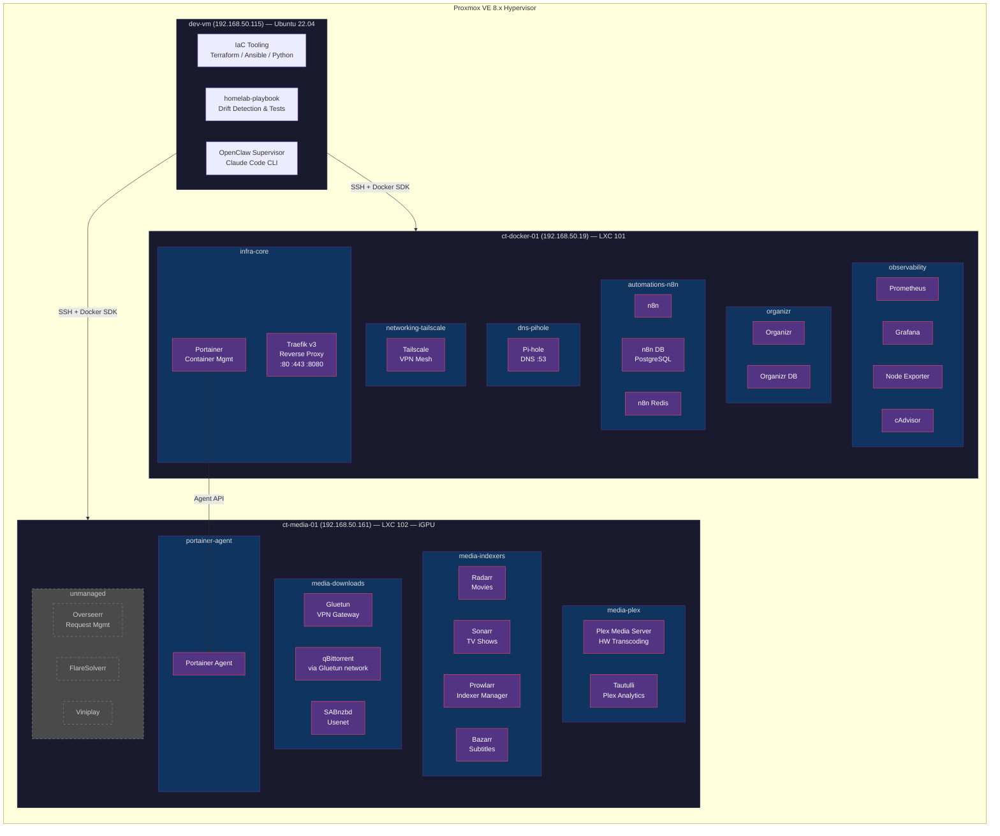

# Host Topology - Homelab Infrastructure

> Auto-generated from drift report and service catalog data (2026-02-08)

## Host Summary

| Host | LXC ID | IP Address | Role | Stacks | Services |
|------|--------|------------|------|--------|----------|
| dev-vm | — | 192.168.50.115 | Orchestration | — | Terraform, Ansible, Python tooling |
| ct-docker-01 | 101 | 192.168.50.19 | Application Host | 6 | 12 |
| ct-media-01 | 102 | 192.168.50.161 | Media Server | 4 (+unmanaged) | 14 |
