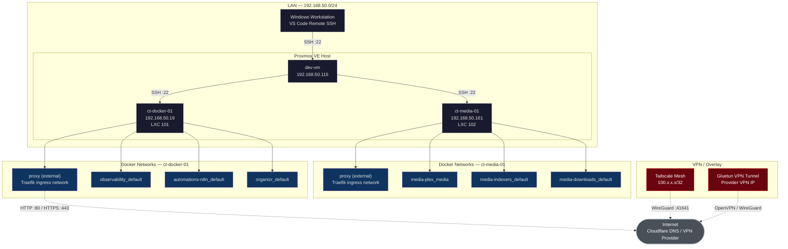
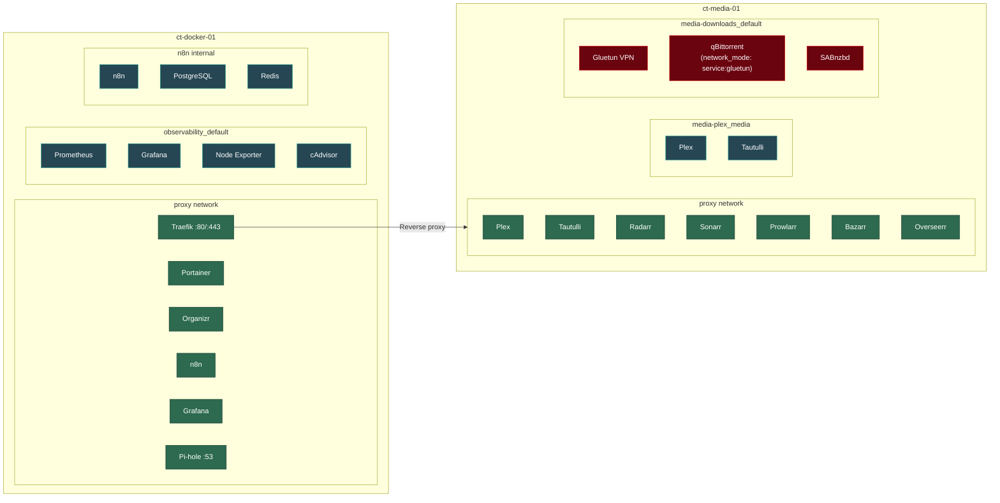

# Network Topology - Homelab Infrastructure

> Auto-generated from drift report and architecture docs (2026-02-08)

## Network Architecture

## Docker Network Detail

## Port Exposure

| Service | Port | Protocol | Exposure |
|---------|------|----------|----------|
| Traefik | 80, 443, 8080 | HTTP/HTTPS | LAN (ingress for all HTTP services) |
| Pi-hole | 53 | DNS (TCP/UDP) | LAN (DNS resolver) |
| Plex | 32400 | HTTP | LAN + Tailscale (media streaming) |
| Tailscale | 41641 | WireGuard | Internet (VPN mesh) |
| Gluetun | — | OpenVPN/WG | Internet (download VPN tunnel) |
| All others | — | — | Internal only (via Traefik proxy network) |

## Network Security Zones

| Zone | Networks | Access |
|------|----------|--------|
| **Ingress** | proxy (external) | Traefik terminates all external HTTP/HTTPS |
| **Internal** | stack-specific defaults | Service-to-service only, no host ports |
| **VPN Tunnel** | Gluetun container network | qBittorrent traffic exits via VPN provider |
| **Mesh VPN** | Tailscale 100.x.x.x | Remote access to Traefik ingress |
| **Management** | LAN SSH :22 | dev-vm to LXC containers |
