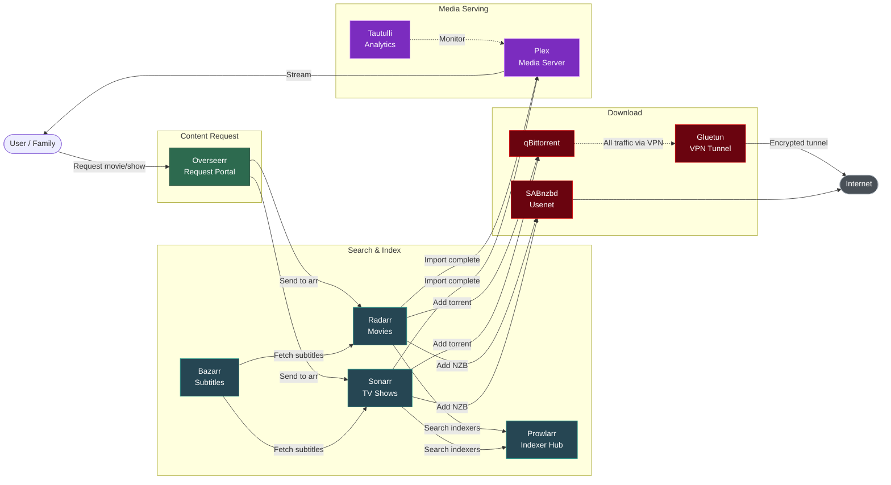
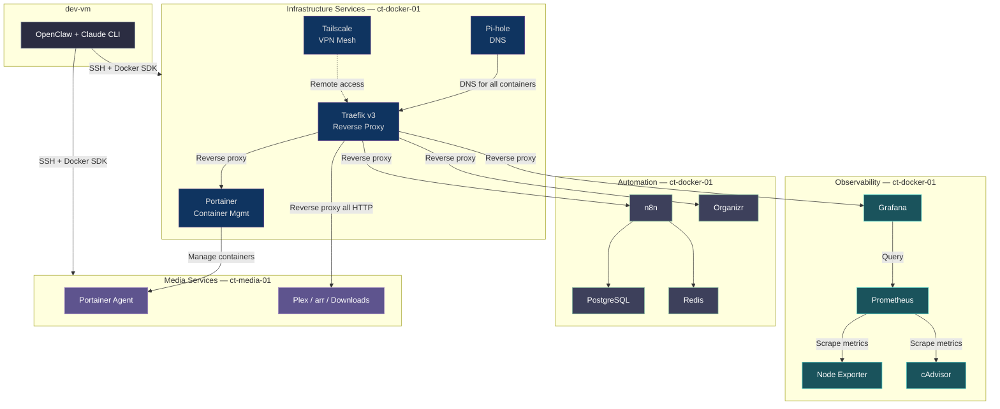

# Service Connections - Media Pipeline & Integrations

> Auto-generated from drift report, service catalog, and architecture docs (2026-02-08)

## Media Request Pipeline

## Infrastructure Integrations

## Data Flow Summary

| Flow | Path | Protocol |
|------|------|----------|
| Content Request | User -> Overseerr -> Radarr/Sonarr | HTTP API |
| Indexer Search | Radarr/Sonarr -> Prowlarr -> Indexers | HTTP API |
| Torrent Download | Radarr/Sonarr -> qBittorrent -> Gluetun -> Internet | BitTorrent over VPN |
| Usenet Download | Radarr/Sonarr -> SABnzbd -> Usenet Providers | NNTP/TLS |
| Media Import | Radarr/Sonarr -> Plex library folders | Filesystem (shared volume) |
| Media Playback | User -> Plex (via Traefik) | HTTP/HTTPS |
| Subtitle Fetch | Bazarr -> OpenSubtitles/Subscene | HTTP API |
| Monitoring | Prometheus -> Node Exporter / cAdvisor -> Grafana | HTTP scrape |
| DNS | All containers -> Pi-hole | DNS :53 |
| Remote Access | Tailscale mesh -> Traefik | WireGuard |
| Management | dev-vm -> ct-docker-01 / ct-media-01 | SSH + Docker SDK |
